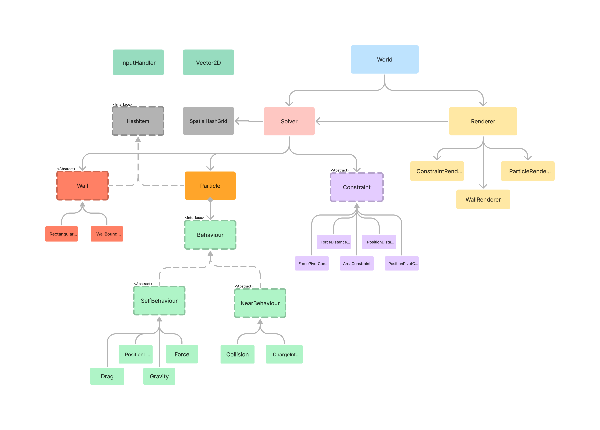

# Particle Physics Engine 2D (PPhys2D)

`PPhys2D` is a lightweight 2D particle physics library written in vanilla JavaScript intended for use with web browsers. Some of the key features we support are:
- Interactive particles, constraints, and static walls 
- Constrained dynamics, collisions, and particle behaviors
- Particle-based fluid simulations (SPH)
- Efficient spatial interactions with spatial hashing algorithm
- 2D HTML canvas rendering
- Input handling and vector math utility classes


All the source code is fully documented (in the `src` folder), and it will offer detailed explanations if something is not covered in this documentation.

## Getting Started
### For use in browser
link the file `pphys2d.js` or `pphys2d.min.js` in the `dist` folder with a script tag before the general script file.

```html
<script src="pphys2d.js"></script>
<script src="script.js"></script>
```

To access the `pphys2d` modules, use the global object `pphys`
``` js
var gravity = new pphys.behaviors.Gravity(9.8);
```

Default pphys2d rendering interacts with the html `canvas` element, to start:
``` html
<canvas id="test"></canvas>  // in the html file
``` 
``` js
const canvas = document.getElementById("test"); // in the js file
...
```

### For use with node.js
Download the src folder and put that in the `node_module` folder in the project directory. This is not recommended as many features is not supported in node, although using node can help generate clean code for use in a browser.

Modules can then be imported with `requires` or `import`.


## Demos
More to come... if i remember...

[Newton's Cradle](./demos/newtons-cradle/index.html)

[String Strands](./demos/strands/index.html)

[Cloth](./demos/cloth/index.html)

[Soft Body](./demos/softbody/index.html)

[Fluid Sorting](./demos/fluid-sorting/index.html)

[Viscous Fluid Flow](./demos/flowing-fluid/index.html) (this has some stability issues)

[Flowing Sand](./demos/powder-force/index.html) 

**Work in Progress**:


Surface Tension

Brownian Motion

Stacking (it explodes!)

Fluid Playground

Rigid Body

Truss

Charge Interactions

Pendulums

Input Handler Fun

A little bit of everything

## Structure
The key modules of `pphys2d` are
``` js
pphys.behaviors, pphys.constraints, pphys.core, pphys.renderers, pphys.utils, pphys.walls
```
Further documentation is available for each module.

[UML diagram figma link](https://www.figma.com/file/RmAHDNunrpGmugKVVT1JYa/physics?type=whiteboard&node-id=0-1&t=kJgXQj8zSvmgEPtW-0)



### Explanation
The `world` is the "scene" that pphys displays 
- The `solver` is responsible for calculating the physics of the world
- Optionally, default rendering can be used to visualize the physics

The world consists of 3 main objects: **particles**, **constraints**, and **walls**.
- particles are the focus of the engine
- constraints restrict particles in some way (they do not collide)
- and walls are static elements that particles collide with

A particle has associated behaviors
- `SelfBehaviors` that only influences the single particle it is attached to
- `NearBehaviors` that influence the particle it is attached to, as well as any surrounding particles

Other miscellaneous classes include:
- `Vector2D` for vector operations
- `InputHandler` for controlling user input
- `HashItem` and `SpatialHashGrid` for efficient spatial partition

## Implementation Notes
Technical implementation details can be found [here](./pphys_paper.pdf). It should provide a decent technical overview; however, it is **not up to date**.

As a general overview, `pphys2D` is an impulse-based particle physics engine that uses a predictor-corrector numerical integration model. Simply put, 
``` js
for particle in particles
    // "pre-move" to future position
    particle.prevPosition = particle.position
    particle.position = particle.position + particle.velocity * timeStep

    // using the future position apply particle behaviors:
    for behavior in particle.behaviors:
        applyEffect()

// apply constraints
for constraint in constraints:
    applyEffect()

// update particle positions
for particle in particles:
    particle.velocity = (particle.position - particle.prevPosition) / timeStep

// apply final position corrections
for particle in particles:
    for behavior in particle.behaviors:
        applyCorrection()
```
This engine does not use force-based accumulation, because changes must be immediately updated. As such, any forces are linearly-discretized and converted to a change in `position`. 
```js
v = v + a * dt;
x = x + v * dt;
```

Velocity is typically not updated in behaviors or constraints unless it is a velocity dependent behavior (like collisions).

To ensure stiffness and behavior resolution, a final position correction is applied **after** velocity update. However, since pphys2d uses a local iterative solver, constraint solving and position correction can be performed multiple times per frame to enhance system convergence.

This is a variation on the common **semi-implicit Euler** solver algorithm, and in comparison, should be more stable for large impulses. As such, this algorithm should also be symplectic (i think). However, large constraint/behavior impulses either lead to a huge loss in energy or system divergence. Perhaps I will perform more quantitative tests in the future ;)

